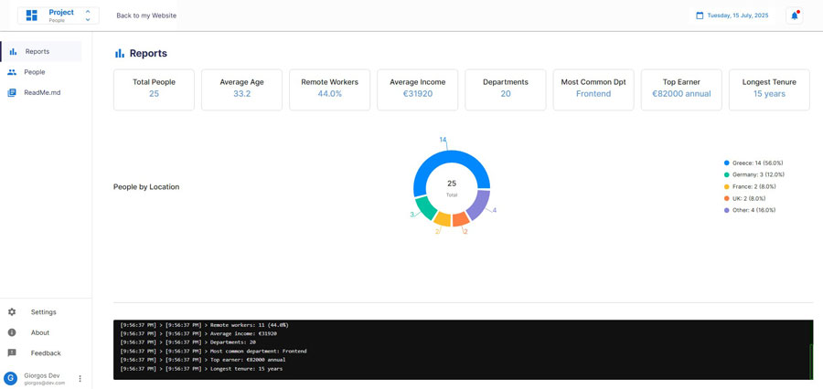
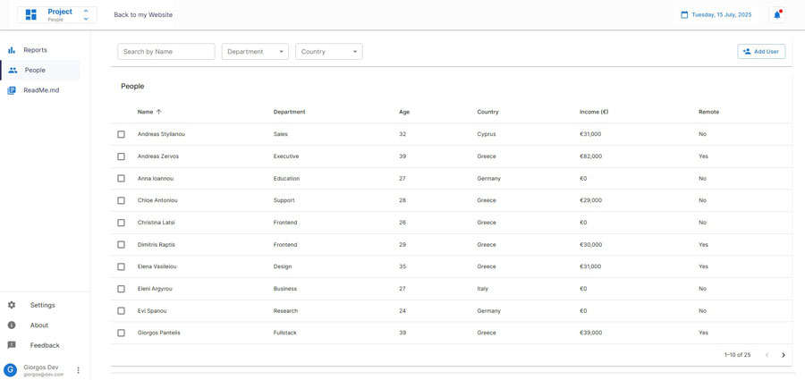

# React Project #1 – Dashboard

A modern, interactive dashboard built with React and Material UI. This project showcases reusable components, filtering/sorting functionality, and clean UI structure using context-based state management.




## 🚀 Purpose

This project serves as a practical playground to experiment with React concepts such as:

- Context API and state sharing
- Custom reusable components
- Material UI integration
- Real-time filtering, sorting, and searching
- CRUD operations with modals and dialogs

It's the first in a series of structured React projects aimed at improving real-world development skills.

## ✨ Features

- 📊 Dashboard with data
- 🧾 Report page with data insights and visualizations
- 🔍 People page with live search, department and country filters, sorting, and pagination
- 👥 A popup form for creating, editing, and deleting users (work in progress)
- 🧩 Modular structure with MUI components
- 🎨 Partially custom MUI theme and layout system
- 🖥️ Simulated terminal interface displaying mock requests, calculations, and user interactions

## 🛠️ Technologies Used

- **Frontend:** React, React Router, Material UI (MUI)
- **State Management:** React Context
- **Build Tool:** Vite
- **Styling:** CSS & MUI theme overrides
- **API/Backend:** `json-server` for mock data initially but upgraded to a functional API

## 📋 Project Structure

```
react25/
├── public/
├── src/
│ ├── assets/
│ ├── components/
│ │ ├── layout/
│ │ │ │ ├── dashboard/
│ │ │ │ │ ├── DashboardContent.jsx
│ │ │ │ │ ├── People.jsx
│ │ │ │ │ ├── ProfileMenu.jsx
│ │ │ │ │ ├── ReadMe.jsx
│ │ │ │ │ ├── Reports.jsx
│ │ │ │ │ ├── Sidebar.jsx
│ │ │ │ │ ├── Terminal.jsx
│ │ │ │ │ └── UserFormDialog.jsx
│ │ │ ├── Layout.jsx
│ │ │ ├── Header.jsx
│ │ ├── Loader.jsx # not used
│ │ ├── Loader.css
│ ├── config/
│ │ ├── theme.js
│ │ └── layoutSettings.js
│ ├── data/
│ │ ├── db.json # Fake API database
│ │ └── DataContext.jsx # Shared data provider
│ ├── App.jsx
│ ├── App.css
│ ├── index.css
│ ├── main.jsx
├── package.json
├── vite.config.js
├── .gitignore
└── README.md
```

---

## 🛤️ The Road So Far

This project began as a simple single-page playground to practice JavaScript methods. As my curiosity grew, I introduced React Router to explore routing and started splitting the app into multiple pages—still without styling at this stage.

Wanting a better structure, I experimented with tabs and basic custom styling. But soon I needed dynamic data. I simulated a fake API using json-server, running the app and server in two separate terminals. To simplify the process, I used the concurrently package and created the npm run go command to launch both services together.

As the app became more data-driven, I brought in Material UI (MUI) to give structure and styling to components. However, things started getting messy—so I stepped back and refactored everything into a proper dashboard layout, using almost completely Material UI (MUI). That phase took a few days of trial and error, but it helped me rework previous pages and significantly improve both the logic and the UI.

I added new features, applied improvements, and spent time debugging — especially when I started passing props between components and managing data across different parts of the app. I also handled basic responsiveness, although it wasn’t the main focus—so the mobile view is still rough.

After that, I wanted to explore state management, as it became necessary for handling API data across multiple components. I decided to start with the useContext hook to build a solid foundation before moving to more advanced solutions like Zustand, TanStack Query, or Redux, depending on the needs of future projects.

While finishing the project, I started thinking about how to share my work. I didn’t want it to live just on GitHub, where someone would have to install and run it locally to inspect it — I wanted it to be accessible live online, instantly. That led me to set up a real API on a hosted domain instead of using json-server, so I could publish the full app online and demonstrate its functionality without requiring any setup from the viewer.

Now, I'm planning a portfolio master app that will act as the home for all my future projects—no matter the stack.

This is the first finished step in that journey.

## 🚦 Getting Started

### Prerequisites

- Node.js (v14.0.0 or later)
- npm or yarn

### Installation

1. Clone the repository:
   ```bash
   git clone https://github.com/Tsiroto/react25.git
   cd react25
   ```

2. Install dependencies:
   ```bash
   npm install
   ```

3. To run only the frontend:
   ```bash
   npm run dev
   ```
   
4. Open your browser and navigate to `http://localhost:5173`


## 📬 Reach Me

### If you'd like to connect, collaborate, or just say hi, feel free to reach out:

- 📧 Email: doufasg@gmail.com
- 💼 LinkedIn: https://www.linkedin.com/in/georgios-ntoufas/
- 🐙 GitHub: [@Tsiroto](https://github.com/Tsiroto)

## 📄 License


This project is for personal or educational use. No license is currently applied.