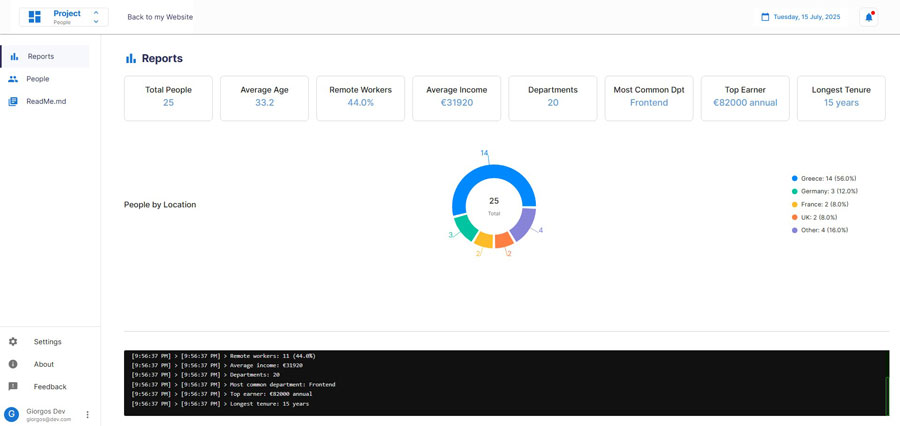
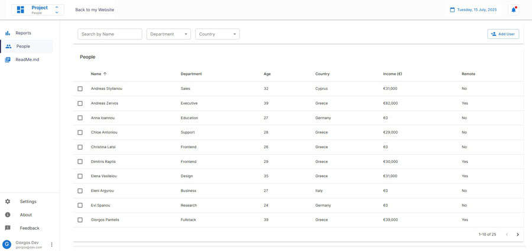

# React Project #1 – Dashboard

A modern, interactive dashboard built with React and Material UI. This project showcases reusable components, filtering/sorting functionality, and clean UI structure using context-based state management.




## 🚀 Purpose

This project serves as a practical playground to experiment with React concepts such as:

- Context API and state sharing
- Custom reusable components
- Material UI integration
- Real-time filtering, sorting, and searching
- CRUD operations with modals and dialogs

It's the first in a series of structured React projects aimed at improving real-world development skills.

## ✨ Features

- 📊 Dashboard with mock data using `json-server` and soon an API
- 🧾 Report page with data insights and visualizations
- 🔍 People page with live search, department and country filters, sorting, and pagination
- 👥 A popup form for creating, editing, and deleting users (work in progress)
- 🧩 Modular structure with MUI components
- 🎨 Partially custom MUI theme and layout system
- 🖥️ Simulated terminal interface displaying mock requests, calculations, and user interactions

## 🛠️ Technologies Used

- **Frontend:** React, React Router, Material UI (MUI)
- **State Management:** React Context
- **Build Tool:** Vite
- **Styling:** CSS & MUI theme overrides
- **API/Backend:** `json-server` for mock data (will be replaced with a real API soon)

## 📋 Project Structure

```
react25/
├── public/
├── src/
│ ├── assets/
│ ├── components/
│ │ ├── dashboard/
│ │ │ ├── DashboardContent.jsx
│ │ │ ├── People.jsx
│ │ │ ├── Reports.jsx
│ │ │ ├── Terminal.jsx
│ │ │ ├── ReadMe.jsx
│ │ │ └── UserFormDialog.jsx
│ │ ├── layout/
│ │ │ ├── Layout.jsx
│ │ │ ├── Sidebar.jsx
│ │ │ ├── Header.jsx
│ │ │ ├── Loader.jsx
│ │ │ └── Loader.css
│ ├── config/
│ │ ├── theme.js
│ │ └── layoutSettings.js
│ ├── data/
│ │ ├── people.js # Local mock dataset
│ │ └── DataContext.jsx # Shared data provider
│ ├── App.jsx
│ ├── App.css
│ ├── index.css
│ ├── main.jsx
├── db.json # Fake API database
├── package.json
├── vite.config.js
├── .gitignore
└── README.md
```

## 🚦 Getting Started

### Prerequisites

- Node.js (v14.0.0 or later)
- npm or yarn

### Installation

1. Clone the repository:
   ```bash
   git clone https://github.com/yourusername/react25.git
   cd react25
   ```

2. Install dependencies:
   ```bash
   npm install
   ```

3. Start the development server and mock API together:
   ```bash
   npm run go
   ```
   This command uses [concurrently](https://www.npmjs.com/package/concurrently) to run both the Vite dev server and the mock API server (using `json-server` with `db.json`) at the same time.

   - To run only the frontend:
     ```bash
     npm run dev
     ```
   - To run only the mock API server:
     ```bash
     npm run serve
     ```

4. Open your browser and navigate to `http://localhost:5173`


## 📝 Examples

### JavaScript Data Manipulation

The playground includes examples of:
- Filtering and searching data
- Calculating averages and percentages
- Using array methods (map, reduce, filter)
- Working with Sets for unique values


## 🧩 Development Utilities

### concurrently

This project uses the [`concurrently`](https://www.npmjs.com/package/concurrently) package to streamline development:

- **What it does:**
  - Allows running multiple commands (such as the Vite dev server and a mock API server) simultaneously in one terminal window.
- **Why it's used:**
  - Simplifies the workflow by letting you start both frontend and backend (or other processes) together with a single command, making development faster and more convenient.


## 📄 License

To kill. (services)

This project is for personal or educational use. No license is currently applied.